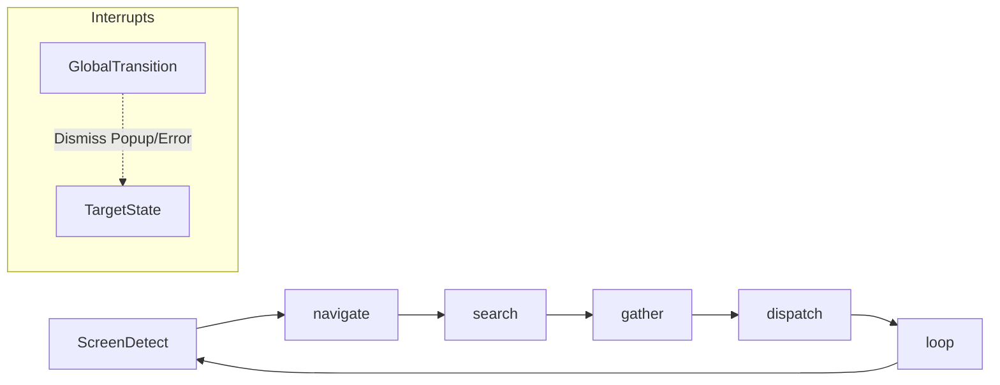

# TAuto Bot Development Guide

> Practical guidance for building TAuto bots around `StateMachineBuilder`, `ScriptContext`, and observable UI states.

---

## 1. Core Architecture

TAuto bots in this repo operate on a screen-driven state machine model:

- **State = Observable Screen**: Each state represents a recognizable UI screen or application state, not just a procedural step.
- **Reactive, Not Procedural**: The bot observes the screen and reacts accordingly, rather than following a rigid, linear script.
- **GlobalTransition**: Acts as a high-priority interrupt handler, triggerable from any state (e.g., for popups or errors).
- **ProtectedStates**: A whitelist of states where interrupts are explicitly disabled to prevent disruption during critical flows.



---

## 2. Bot Structure (C#)

```csharp
public class MyBot : BotBase
{
    // 1. Configuration and Arguments
    public override BotConfiguration GetConfiguration() { ... }

    // 2. State Definitions (Enum)
    private enum S { ScreenDetect, DoSomething, END }

    // 3. Context Variable Constants
    private static class V {
        public const string Counter = "Counter";
    }

    // 4. Entry Point
    public override async Task RunAsync()
    {
        var machine = new StateMachineBuilder()
            .StartAt(nameof(S.ScreenDetect))
            .GlobalTransition(...) // Register interrupts
            .State(nameof(S.ScreenDetect))
                ...
            .Build();

        // Required: Track current state for ProtectedStates logic
        machine.OnStateChanged += (_, name) => Context.SetVariable("_currentState", name);
        
        await machine.RunAsync(Context, CancellationToken);
    }
}
```

---

## 3. Defining States

### Principles
- **Naming**: State names should describe observable UI (`GatherScreen`, `SettingsPanel`), not procedural steps (`Step1`, `ClickButton1`).
- **Composition**: Each state consists of **Entry Actions** (logic executed once upon entry) and **Transitions** (logic determining the next state).

### Entry Actions
Executed **once** when entering the state. Used for clicks, OCR, logging, etc.

```csharp
.State(nameof(S.GatherScreen))
    .Log("Target identified! Clicking Gather...")     // Log to console
    .Action(new ClickImageAction { ... })              // Use standalone action
    .Delay(2000)                                       // Wait for UI response
    .PressKey("Escape")                                // Send keyboard input
    .TapScaled(640, 360)                               // Tap coordinated (auto-scaled)
    .Action(async (ctx, ct) => {                       // Custom C# logic
        // Complex custom processing...
        return ActionResult.Ok();
    })
```

### Transitions
Define where to go next based on visual or logical conditions.

```csharp
.State(nameof(S.ScreenDetect))
    // High priority transitions are checked first
    .TransitionTo(nameof(S.ConfirmAction),
        When.ImageFound("templates/confirm_btn.png", 0.8), priority: 50)

    // Fallback: Checked last if no other conditions match
    .Fallback(nameof(S.OpenMainPanel), timeoutMs: 5000)
```

---

## 4. Conditions: The `When` Helper

| Method | Use Case |
|--------|----------|
| `When.ImageFound(path, threshold)` | Trigger when a specific image is visible. |
| `When.TextFound(text)` | Trigger when specific text is recognized via OCR. |
| `When.IsTrue(varName)` | Trigger when a boolean variable is `true`. |
| `When.IsFalse(varName)` | Trigger when a boolean variable is `false`. |
| `When.Variable(name, value)` | Trigger when a variable matches a specific string value. |
| `When.Condition(async (ctx, ct) => ...)` | Custom logic lambda. |
| `When.Always` / `null` | Unconditional transition. |

### ⚠️ Critical Note on `IfVariableAction`

The internal `IfVariableAction` (used by `IsTrue`, `IsFalse`, `Variable`) has a specific behavior: If no `ElseActionId` is provided, it returns `Fail()` when the condition is false. This allows the State Machine to move to the next transition or fallback correctly.

---

## 5. GlobalTransition: Interrupt Handlers

Global transitions check for conditions (like popups or errors) across **all** states.

```csharp
// 1. MUST track current state in RunAsync()
machine.OnStateChanged += (_, name) => Context.SetVariable("_currentState", name);

// 2. Define Protected States where interrupts are forbidden
private static readonly HashSet<string> ProtectedStates = new()
{
    nameof(S.SensitiveFlow),
    nameof(S.ProcessingPayment),
    nameof(S.DismissPopup),    // ALWAYS include the target state itself to avoid loops
};

// 3. Register Global Transition
builder.GlobalTransition(nameof(S.DismissPopup),
    When.Condition(async (ctx, ct) =>
    {
        // Check if current state is protected
        string current = ctx.GetString("_currentState");
        if (ProtectedStates.Contains(current))
            return ActionResult.Fail($"Protected state: {current}");

        // Identification logic
        if (await IsImageVisible(ctx, "templates/popup_close.png"))
            return ActionResult.Ok();

        return ActionResult.Fail("No popup detected");
    }),
    priority: 200) // Ensure priority is higher than local transitions
```

### 3 Common GlobalTransition Mistakes

1.  **Checking `LastScreenCapture == null` too early**: Do not fail a condition just because the previous cached frame is null. `When.ImageFound` and explicit `UpdateScreenCaptureAsync()` calls are the intended capture path.
2.  **Missing Target in `ProtectedStates`**: If the target state of a GlobalTransition (e.g., `DismissPopup`) is not in the `ProtectedStates` list, the interrupt might trigger *again* before the entry actions (closing the popup) can finish, resulting in an infinite loop.
3.  **Timing (EvaluateGlobalsBeforeEntry)**: Interrupts are checked **before** the entry actions of a state. If a popup appears *during* a 10s wait in an entry action, the interrupt will only fire *after* that action completes.

---

## 6. Context Variables

Manage state and bot memory through the `ScriptContext`.

```csharp
// Set and Get
ctx.SetVariable("MyCount", 10);
int val = ctx.GetInt("MyCount", defaultValue: 0);
bool flag = ctx.GetBool("IsActive", false);

// Counters
ctx.Increment("FailCounter");           // Defaults to +1
ctx.Increment("RetryCount", amount: 3);
```

---

## 7. OCR with `ExtractTextAction`

For high-precision recognition:
- **Scale (3.0-4.0)**: Mandatory for small text.
- **Threshold (150)**: Ideal for Otsu Adaptive Thresholding.
- **UseVoting**: Runs OCR multiple times to find the most frequent result.

### Example: Parsing "x/y" Counters
```csharp
private static (int current, int max) ParseCounter(string raw)
{
    if (string.IsNullOrWhiteSpace(raw)) return (0, 0);
    
    // Standard "part1/part2" parsing
    if (raw.Contains('/')) {
        var parts = raw.Split('/');
        // ... parse parts using char.IsDigit filtering
    }
    
    // Fallback for OCR missing the slash (e.g., "45" instead of "4/5")
    var digits = new string(raw.Where(char.IsDigit).ToArray());
    if (digits.Length >= 2) {
        // ... logic to infer current/max based on known digit counts
    }
    return (0, 0);
}
```

---

## 8. Orientation: The `ScreenDetect` Pattern

The first state should always be a "Compass" or orientation state that observes the UI and routes the bot to the correct flow.

```csharp
.State(nameof(S.ScreenDetect))
    .Log("Identifying current location...")
    .TransitionTo(nameof(S.InSettings), When.ImageFound("settings_hdr.png"), priority: 10)
    .TransitionTo(nameof(S.OnDashboard), When.ImageFound("dash_icon.png"), priority: 20)
    .Fallback(nameof(S.OpenMenu)) // Default action if location unknown
```

---

## 9. Robustness: `ErrorRecovery` State

Never transition directly back to `ScreenDetect` on failure. Instead, use an `ErrorRecovery` state to stabilize the UI (e.g., pressing Escape, clicking standard offsets).

```csharp
.State(nameof(S.ErrorRecovery))
    .Log("Error detected! Stabilizing UI...")
    .Action(new PressKeyAction { Key = "Escape" })
    .Delay(2000)
    .TransitionTo(nameof(S.ScreenDetect))
```

---

## 10. Termination Logic

A state machine should have a clear path to `END` or a transition to a final idle state.

```csharp
.State(nameof(S.IdleWait))
    .Action(async (ctx, ct) => {
        int wait = ctx.GetArgInt("WaitSeconds", 60);
        if (wait <= 0) return ActionResult.Ok("END");
        await Task.Delay(wait * 1000, ct);
        return ActionResult.Ok();
    })
    .TransitionTo("END", When.Condition(...))
    .TransitionTo(nameof(S.ScreenDetect))
```

---

## 11. Debug Checklist

| # | Check | Debugging Tip |
|---|-------|---------------|
| 1 | Is GlobalTransition firing? | Log `ActionResult` inside the `When.Condition` lambda. |
| 2 | Is the Template matching? | Log the `Confidence` value returned by the Vision service. |
| 3 | Is the State Protected? | Log `ctx.GetString("_currentState")` inside your check. |
| 4 | Is Variable logic working? | Remember that `SetVariable` must use the same type as `When.IsX` expects. |
| 5 | Is OCR accurate? | Use `LogResult = true` in `ExtractTextAction` to see raw output in logs. |
